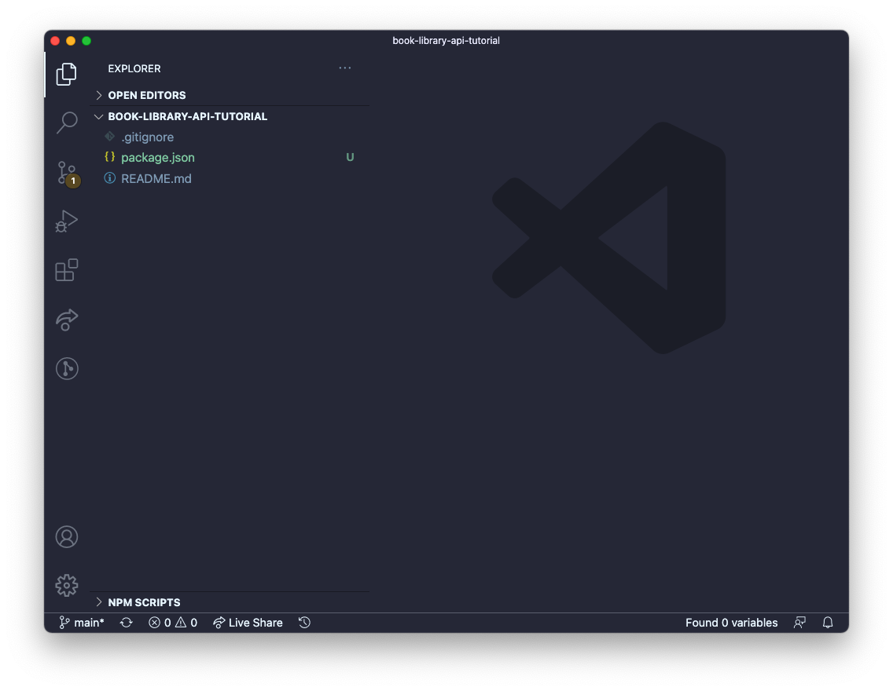
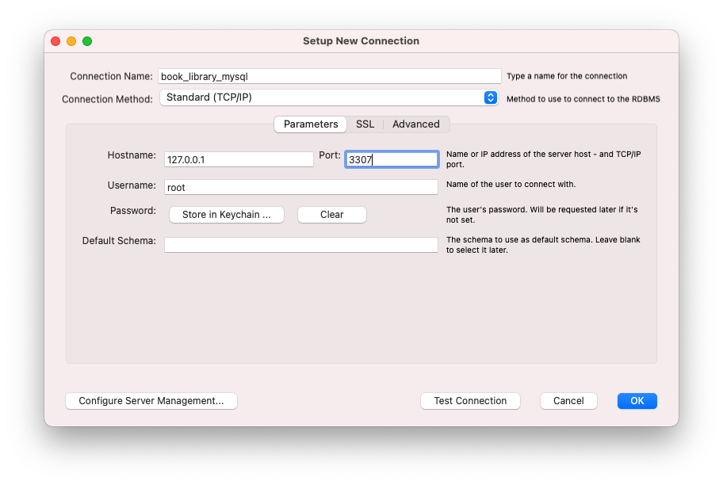
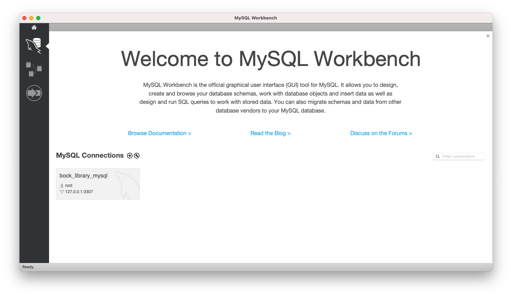
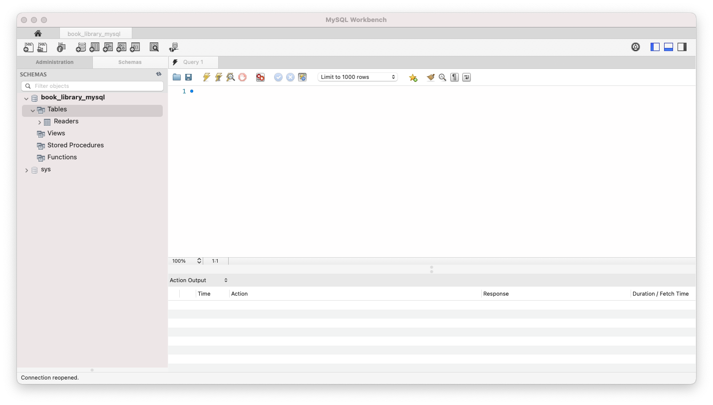
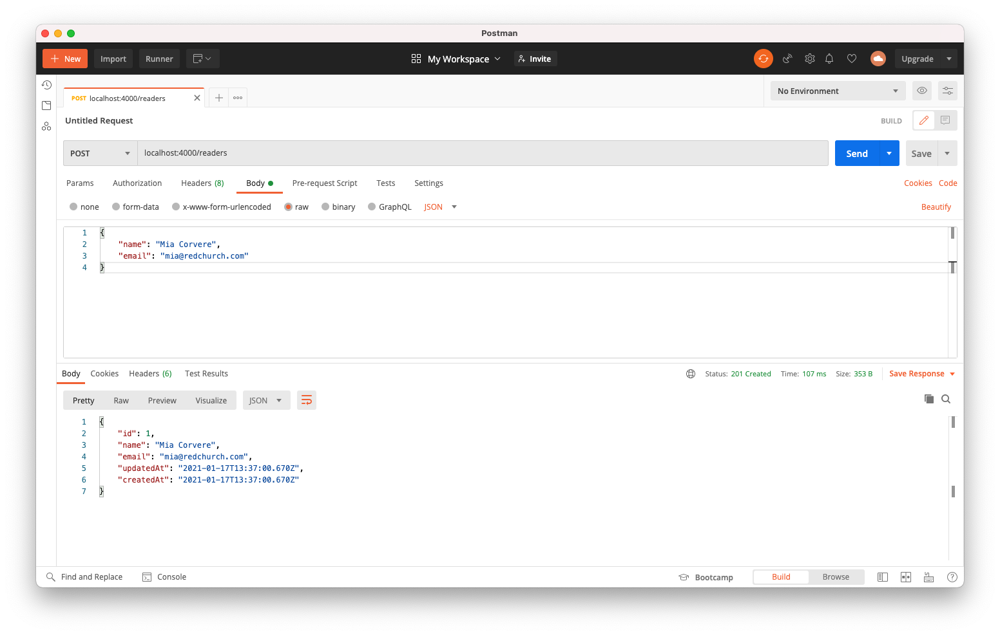
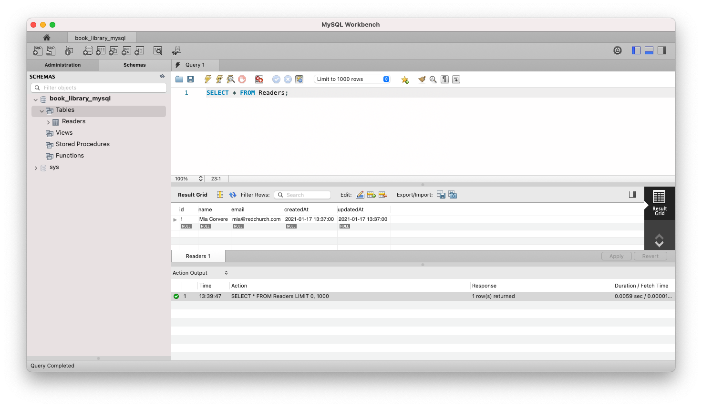

# Build an API using Express - a tutorial

In this tutorial, we're going to build a REST API from scratch. We're going to use Express, the Node.js backend framework, to build it. We're also going to create a MySQL database to hold our data (inside a Docker container) and we're going to use Sequelize to communicate between our Express app and the database.

Our API will be able to create, read, update and delete records in our database - the full range of CRUD operations.

What's more, we're going to test our API at every stage, following Test Driven Development (TDD) practices. To do this, we'll be using the Mocha test framework, along with Chai and Supertest.

AND as if that wasn't enough, we're going to make use of some cool technologies and tools - dotenv, Nodemon and Postman.

So, let's dive in...

[Full disclosure - this is a long post. Go and make a cup of tea or coffee, and maybe plan to build this over a couple of days :) If you get completely stuck, you can view the finished code [in this GitHub repository](https://github.com/jlopenshaw41/api-tutorial)]

## Contents
* [Project setup](#create-a-new-folder-for-the-project-and-set-up-a-GitHub-repo)
* [Database & Docker container setup](#set-up-a-new-docker-container-with-a-new-mysql-database)
* [Express application setup](#set-up-the-express-application)
* [TDD & test setup](#set-up-the-tests)
* [Adding database tables](#adding-tables-to-our-database)
* [Adding CRUD functionality](#adding-functionality-to-our-api-to-create-new-records-in-the-database)

## Create a new folder for the project and set up a GitHub repo

First things first...

1. Set up a new folder for your API project

   [I use the command line to create new folders - I've put the commands I used after each step in this tutorial]

   `mkdir book-library-api`

2. Change directory into that folder and start git tracking:

   `cd book-library-api`

   `git init`

3. Create a README.md file and a .gitignore file:

   `touch README.md .gitignore`

   [There's a great [readme template](https://github.com/ritaly/README-cheatsheet) that I use. If you want to use it too, open your new README file and paste the template text. You can complete it later, when you've built your API]

4. Go to your profile on GitHub and create a new repository, also called 'book-library-api'

5. Connect your local repo to your new GitHub repo by entering the command given to you by GitHub:

   `git remote add origin git@github.com:<your-username>/book-library-api.git` [it'll look something like this, but be sure to use your own link with your username etc]

6. Stage and commit the two files you've created and push to your GitHub repo as an 'initial commit'

   `git add .`

   `git commit -m 'initial commit'`

   `git push -u origin main` [n.b. I've already configured my local machine to default to 'main' branch instead of 'master' - if you haven't done this, you'll also need to rename your branch *before* you do this first push, using the command helpfully given to us by GitHub - `git branch -M main`]

7. Initialise a new npm project, filling in the relevant details (description, author) when prompted - you can just hit enter to accept the defaults for the other entries. A `package.json` file will be automatically created

   `npm init`

8. Open the project folder in your code editor [I use VS Code - you can type `code .` to do this from the command line]. You should see the .gitignore, package.json and README.md files that you've just created:

   

9. Add the following text to your .gitignore file:

   `node_modules`

   [When we install software like Express, which we'll be doing in a minute, a whole heap of 'node modules' are automatically added to our project folder. We don't want all these uploaded to GitHub - adding this line to our .gitignore file tells git to ignore them]

   Well done, that's the basics out of the way.

## Set up a new Docker container with a new MySQL database

This project uses a MySQL database. MySQL is a popular database management system for creating and working with relational databases.

As an added quirk, rather than install MySQL directly on our machines, we're going to use Docker to create and run the database inside a _container_. A container is a Docker thing - it is like a self-contained box that lives on your machine and the database then lives inside it. Docker containers come pre-configured for different things - there's a specific MySQL container, and a postgres one, and a mongodb one and hundreds of thousands of others.

Why do we create our database inside a Docker container and not just install MySQL directly on our own computers? Well apparently installing and maintaining MySQL on our machines can be complicated, and the process differs depending on your operating system (one quick look at the 'Getting started' page on the MySQL website confirmed that for me). It is much simpler for everyone to install Docker and create a MySQL container with a new database in it, which automatically has all the correct configuration for working with a MySQL database, regardless of what sort of computer/operating system you're on. Handy. It also has the added advantage that it is fairly easy for us to get rid of the container and start again from scratch if we mess our database up.

If you haven't already installed Docker on your machine, visit their [website](https://www.docker.com/get-started) and follow the instructions for your machine/operating system. Likewise, install [MySQL Workbench](https://www.mysql.com/products/workbench/), which we're going to use to view our database.

[The following instructions are the steps I followed using a Mac - it may differ slightly if you're on Windows/linux ]

1. Once you've installed Docker/Docker Desktop, run the following command in your terminal to set up a new Docker MySQL container with a new database called 'book_library_mysql' then check it is running - you should see the container listed after running `docker ps`:

   `docker run -d -p 3307:3306 --name book_library_mysql -e MYSQL_ROOT_PASSWORD=secret mysql` (Change the password to your own :) )

   `docker ps`

2. Open MySQL Workbench, add a new MySQL Connection (click the little plus sign next to 'MySQL Connections') and configure the settings in the pop up window (your database name, Hostname 127.0.0.1 and Port 3307 and the password you set earlier). You'll see 'book_library_mysql' appear under connections.

   

   

## Set up the Express application

Now, let go back to our terminal and start installing the packages we're going to need to build our API.

1. Inside your book-library-api folder, install Express and Sequelize as dependencies using the following commands:

   `npm install -S express`

   `npm install -S sequelize`

2. Create a new file called `index.js` in your project folder. Create a new folder called `src` and create a new file inside that `src` folder, called `app.js`

   `touch index.js`

   `mkdir src`

   `cd src`

   `touch app.js`

3. In our newly-created `app.js` file, we're going to set up our Express app. Paste or write the following code:

   ```javascript
   const express = require("express");
   const app = express();

   module.exports = app;
   ```

   What's this code doing? Well, when we installed Express earlier, that put a load of modules (bundles of pre-written code) on our machines (they're in the `node_modules` folder). To make use of those modules we 'require' them in - this is what the first line of code (`const express = require("express");`) is doing. It is allowing us to access and make use of all the Express features that have been pre-written for us. Next, we make use of some of that pre-written functionality to create a new Express app - `const app = express();` - this app is the thing that will allow us to receive requests, process those requests, speak to the database and return the info our user wants. This line of code is basically saying "Hey Express, please can you create us a brand new app, store it in a variable called app, and then we'll get to work on configuring it to do what we want it to do".

   Last but not least, `module.exports = app;` bundles up the app we've just created and makes it available for use in other files, which we'll see in the next step. `module.exports` is the twin to a `require` statement, like the one in the first line - you export something out of a file and require it into another.

4. Next, in your `index.js` file, write the following code:

   ```javascript
   const app = require("./src/app");

   const PORT = 4000;

   app.listen(PORT, () => {
     console.log(`Server is listening at port: ${PORT}`);
   });
   ```

   As we just learned, the first line of this code 'requires' in our newly created app and allows us to make use of it in this file. Next, we create a plain old variable called `PORT` and assign it a value of 4000. Finally, we use a built-in Express method called `listen` to create a new server using our app. We pass the PORT variable that we just created, plus another plain old arrow function (which is known as a callback function when it's passed to another function like this), which console.logs us a message to let us know that our server is up and running and is listening on port 4000 for new requests (which we'll get to soon). In your terminal, make sure you're at the root of your project folder, then run the following command and you should see that message to show your server is running. Cool, huh. Press CTRL + C after, to stop it.

   `node index.js`

5. Install dotenv and nodemon as development dependencies by running the following commands:

   `npm i dotenv --save-dev`
   `npm i nodemon --save-dev`

   These are two useful tools that will help us while we're building our API:

   - [dotenv](https://www.npmjs.com/package/dotenv) is a tool that allows us to store certain things in a separate file, which our app can then access when it needs to. In our case, the separate file is going to hold configuration info that is unique to us (like the name and password we chose for our database). This separation is useful because it keeps our unique info apart from the generic code of the app itself - it's more secure and it makes our app code more reusable.

   - [nodemon](https://www.npmjs.com/package/nodemon) is a tool that restarts our app automatically whenever we make a change. It just saves us a lot of time and hassle having to start it again manually as we're working

6. Open up the `package.json` file and add the following script to the `scripts` section, directly below the `"test":` script that is already there (be sure to add a comma after the `test` script, before your new `start` script):

   `"start": "nodemon -r dotenv/config index.js"`

   Remember we ran `node index.js` earlier, to start our server? Well this is doing the same thing except it is initialising nodemon and dotenv to start doing their things at the same time. And because we've saved it as a script, we just have to write `npm start` in the command line, rather than typing all that out every time. Give it a try:

   `npm start`

   (You can press CTRL + C to exit)

   From now on, whenever we want to start our app, we'll use `npm start` instead of `node index.js`.

   [Now would be a good time to save and commit to git/push to GitHub - don't forget to do this regularly as we work through the project]

7. Create a new folder called 'scripts' in your main book-library-API folder. Inside that scripts folder, create two new files - one called 'create-database.js' and one called 'drop-database.js.

   `mkdir scripts`

   `cd scripts`

   `touch create-database.js drop-database.js`

   Your folder should now look something like this:

   ```
   ├── README.md
   ├── index.js
   ├── package-lock.json
   ├── package.json
   ├── node_modules
   ├── scripts
   │   ├── create-database.js
   │   └── drop-database.js
   └── src
       └── app.js
   ```

8. We're going to paste a load of code that was kindly pre-written by the tutors at my bootcamp, [Manchester Codes](https://www.manchestercodes.com/) (thank you!), into our `create-database.js` file. In a nutshell, this code checks to see if a database already exists, and if it doesn't, it's going to create a new one using some dotenv magic to access some configuration info that we're going to store in a separate file shortly. Paste the following code into `create-database.js`:

   ```javascript
   const mysql = require("mysql2");
   const path = require("path");

   const args = process.argv.slice(2)[0];

   const envFile = args === "test" ? "../.env.test" : "../.env";

   require("dotenv").config({
     path: path.join(__dirname, envFile),
   });

   const { DB_PASSWORD, DB_NAME, DB_USER, DB_HOST, DB_PORT } = process.env;

   const connection = mysql.createConnection({
     host: DB_HOST,
     user: DB_USER,
     password: DB_PASSWORD,
     port: DB_PORT,
   });

   connection.query(`CREATE DATABASE IF NOT EXISTS ${DB_NAME}`, (err) => {
     if (err) {
       console.log(
         `Your environment variables might be wrong. Please double check .env file`
       );
       console.log("Environment Variables are:", {
         DB_PASSWORD,
         DB_NAME,
         DB_USER,
         DB_HOST,
         DB_PORT,
       });
       console.log(err);
     }
     connection.close();
   });
   ```

9. Now paste the following code into the `drop-database.js` file. You've guessed it - this code deletes the database (which is necessary when we're testing the database later on, as we want to start from a fresh database each time.)

   ```javascript
   const mysql = require("mysql2");
   const path = require("path");

   require("dotenv").config({
     path: path.join(__dirname, "../.env.test"),
   });

   const { DB_PASSWORD, DB_NAME, DB_USER, DB_HOST, DB_PORT } = process.env;

   const connection = mysql.createConnection({
     host: DB_HOST,
     user: DB_USER,
     password: DB_PASSWORD,
     port: DB_PORT,
   });

   connection.query(`DROP DATABASE ${DB_NAME}`, () => connection.end());
   ```

10. In `package.json`, add another script below the `start` one:

    `"prestart": "node scripts/create-database.js"`

    This tells Node to run the code in the `create-database.js` file and create a new database (if one doesn't exist already) every time we run `npm start`, before it does anything else.

11. Now we're going to move on to creating a `.env` file. Remember we talked earlier about a separate file to hold our unique configuration info, which our app can then access using dotenv? Well this is that file. Create a new file in the main project folder called '.env'

    `touch .env`

12. Enter the following configuration info in the newly-created .env file:

    [BE SURE TO CHANGE THE PASSWORD TO WHATEVER YOU SET IT AS WHEN SETTING UP YOUR DOCKER CONTAINER AND MYSQL DATABASE EARLIER]

    ```
    DB_PASSWORD=secret
    DB_NAME=book_library_mysql
    DB_USER=root
    DB_HOST=localhost
    DB_PORT=3307
    ```

13. Now this is the key bit - add `.env` to your .gitignore file, below the `node_modules` line, so you don't accidentally post all that unique configuration info, including your password, to GitHub!

14. Next, inside your src folder, create a new folder called 'models' and create a new file called 'index.js' inside that new folder

    `mkdir models`

    `cd models`

    `touch index.js`

    You should now have this:

    ```
    ├── README.md
    ├── index.js
    ├── package-lock.json
    ├── package.json
    ├── node_modules
    ├── scripts
    │   ├── create-database.js
    │   └── drop-database.js
    └── src
        ├── app.js
        └── models
            └── index.js
    ```

    (plus the .env and .gitignore files, which are hidden)

15. Finally, paste the following code into the new index.js file you just created:

    ```javascript
    const Sequelize = require("sequelize");

    const { DB_NAME, DB_USER, DB_PASSWORD, DB_HOST, DB_PORT } = process.env;

    const setupDatabase = () => {
      const connection = new Sequelize(DB_NAME, DB_USER, DB_PASSWORD, {
        host: DB_HOST,
        port: DB_PORT,
        dialect: "mysql",
        logging: false,
      });

      connection.sync({ alter: true });

      return {};
    };

    module.exports = setupDatabase();
    ```

    So what's going on here? [If you'd rather just crack on and not read the explanations, just move on to the next step, I won't tell anyone :) ] Remember we talked at the beginning about using an ORM (Object Relational Mapper) called Sequelize? Well an ORM is a tool that sits between our app and our database and allows us to communicate with it using JavaScript (in our case) to query and manipulate the data in our database. Just like we did with Express earlier, we 'require' Sequelize into our index.js file, which then enables us to make use of Sequelize and the handy features it has.

    The next line in the code we just pasted (`const { DB_NAME, ...` etc) is to do with dotenv and the configuration info we stored in our .env file earlier. Behind the scenes, dotenv will take the variables we wrote in our .env file and load them into something called `process.env`. This line of code is then grabbing that info from `process.env` and storing it in new variables called `DB_NAME`, `DB_USER` etc in this index.js file, for us to use in a second when we connect to the database. (`process.env` is a bit beyond the remit of this blog post, but essentially it is a thing created by node when you start your application. It holds all sorts of info, including - thanks to dotenv - our config info. If you're curious, put `console.log(process.env)` in your app.js file and start your app using `npm start` to see what sort of info is stored in `process.env` - including your DB variables at the bottom. Press CTRL + C to stop the app).

    Turning back to the code we've just pasted in models/index.js, on the next line we've written a function called `setupDatabase`, which creates a new instance of Sequelize, passing in those configuration variables. We need a Sequelize instance to connect to our database; that's how it works. This code is one of the [standard ways of setting up a new sequelize instance](https://sequelize.org/master/manual/getting-started.html) to connect to a database. The `dialect` line tells it we're using a MySQL database (as opposed to a postgres database, or a mariaDB database etc) and the `logging` line tells Sequelize that we don't want it to log every SQL query it performs when it is talking to the database on our behalf. (Our database is a MySQL database, it only understands the SQL language, but Sequelize allows us to write our instructions using JavaScript, and it then converts it into SQL behind the scenes). Last but not least, the `connection.sync` line tells Sequelize to check whether the existing database tables look the same as the models we're going to set up in our code, and to alter them if not, every time it connects.

## Set up the tests

So now we've completed the basic setup of our Express app, we're going to use a combination of three testing tools - Mocha, Chai and Supertest to write tests for our API as we write our code.

1. Install mocha, chai and supertest as development dependencies

   `npm install --save-dev mocha chai supertest`

2. Create a new folder called 'tests' in your project folder and create a new file in that folder called 'test-setup.js'

   `mkdir tests`
   `cd tests`
   `touch test-setup.js`

3. Copy the following code into your new 'test-setup.js' file:

   ```javascript
   const dotenv = require("dotenv");

   dotenv.config({ path: "./.env.test" });
   ```

   This little bit of code makes sure that dotenv reloads our configuration variables to `process.env` (because behind the scenes, we start a new process each time we run our test script so our environmental variables get reset and need loading again).

4. In the main project folder, create a new file called '.env.test'

   `touch .env.test`

5. Copy the code from your `.env` file and paste it into that new `.env.test` file, but be sure to change the database name to something else e.g.

   ```
   DB_PASSWORD=secret
   DB_NAME=book_library_mysql_test
   DB_USER=root
   DB_HOST=localhost
   DB_PORT=3307
   ```

6. Add `.env.test` to your `.gitignore` file

7. In your `package.json` file, update the "test" script to:

   `"test": "mocha tests/**/*.js --exit --recursive --timeout 30000 --file ./tests/test-setup.js"`

   And add the following new "pretest" script:

   `"pretest": "node scripts/create-database.js test"`

   Finally, add a "posttest" script too:

   `"posttest": "node scripts/drop-database.js"`

   These pre and post test scripts will automatically run before and after we run our tests, to create a new database and then delete it afterwards, so that we're testing a fresh database each time.

   Now, if you run `npm test` in your terminal, you should see the tests scripts running (or an error message saying there are no tests to run (because we haven't written them yet!))

### Recap

So, to recap, we have now set up our Express app, our MySQL database (inside its Docker container) and we've set up Sequelize to communicate between our app and the database. We've also set up dotenv to help us when creating/connecting to our database and nodemon to save us the hassle of refreshing our app every time we make a change as we're building it. Additionally, we've set up a testing framework, ready to test our app's functionality as we build it, using a combination of Mocha, Chai and Supertest. Phew! Well done us :)

## The next part - setting up the tests

In this project, our database is a book library. It's going to hold information about a few things: users or 'readers' who can borrow books and the books themselves (obviously). It could also hold, for example, 'lenders' who can loan out books.

First things first, before we write any more code, we're going to write a test or two. The basic principle we are following here is to begin by writing a test to test that our app does whatever particular task we want it to do, then we're going to run that test and check that it fails (of course it will, we haven't written the code to perform the particular task yet), THEN we're going to write the code that performs that task and check that our test now passes. This is following the principles of Test Driven Development (or TDD). You can [read more about TDD here](https://jlopenshaw.hashnode.dev/bootcamp-journal-test-driven-development-tdd).

1. In your tests folder, create a new file called 'readers.test.js'

   `touch readers.test.js`

2. Paste the following code into your readers.test.js file:

   ```javascript
   const { Reader } = require("../src/models");
   const { expect } = require("chai");
   const request = require("supertest");
   const app = require("../src/app");
   ```

   This code 'requires' in a reader model (which we'll get to in a minute), the Chai testing functionality (in particular a piece of functionality that's been pre-written for us called 'expect'), Supertest (which we use because it creates a test server for us so we can properly test our API and replicate what it will do when connected to a real server) and finally, our good old Express app that we created earlier.

   Now we've got access to all the bits we need to write and run tests, we're going to write the actual tests themselves.

3. The testing framework we're using for this project is Mocha. The code below is all Mocha syntax. (Incidentally, it's pretty similar to Jest, another JavaScript testing framework.)

   Paste the following code into your `reader.test.js` file, below the require statements:

   ```javascript
   describe("/readers", () => {
     before(async () => {
       try {
         await Reader.sequelize.sync();
       } catch (err) {
         console.log(err);
       }
     });

     beforeEach(async () => {
       try {
         await Reader.destroy({ where: {} });
       } catch (err) {
         console.log(err);
       }
     });
   });
   ```

   This code makes use of two bits of Mocha functionality - 'before', and 'beforeEach'. The 'before' block of code will automatically run before all of the tests in the file. This particular block of code creates a new instance of our database to perform tests on. Then, so that we start with a blank database for each individual test, the 'beforeEach' block of code clears out the database.

4. Finally, we're going to add our first test. Paste the following code into readers.test.js, below everything else you've just added, but just before the final closing `});`:

   ```javascript
   describe("POST /readers", async () => {
     it("creates a new reader in the database", async () => {
       const response = await request(app).post("/readers").send({
         name: "Mia Corvere",
         email: "mia@redchurch.com",
       });

       await expect(response.status).to.equal(201);
       expect(response.body.name).to.equal("Mia Corvere");
       expect(response.body.email).to.equal("mia@redchurch.com");

       const newReaderRecord = await Reader.findByPk(response.body.id, {
         raw: true,
       });
       expect(newReaderRecord.name).to.equal("Mia Corvere");
       expect(newReaderRecord.email).to.equal("mia@redchurch.com");
     });
   });
   ```

   This is what a test looks like using Mocha syntax. We begin with the `describe` part, which takes a description of what we're testing (in our case, we want to test a HTTP POST request to a url with '/readers' as the endpoint), plus an async callback function. Next, the `it` block has a description of what we expect our test to do in plain English. Then we use the supertest `request` functionality to fire up a version of our `app`. We then send a post request with an object containing the data that we want stored in the readers table of our database. These values could be any strings you like. Finally, we use Chai's `expect` functionality to check that that all worked correctly.

   If you run the test now, using `npm test` you should see that the test runs but fails (as expected!).

## Adding tables to our database

So we've set up the test to check whether a new reader gets added to our database when we send a POST request to a specific url endpoint.

Now we need to write the code that actually makes that happen.

First, we need to create a table in our database to hold info about readers. We do this using Sequelize and something called models.

1. In your models folder, create a new file called 'reader.js':

   `touch reader.js`

2. Paste the following code into that new file:

   ```javascript
   module.exports = (connection, DataTypes) => {
     const schema = {
       name: DataTypes.STRING,
       email: DataTypes.STRING,
     };

     const ReaderModel = connection.define("Reader", schema);
     return ReaderModel;
   };
   ```

   As it says in their [documentation](https://sequelize.org/master/manual/model-basics.html), "models are the essence of Sequelize". Remember Sequelize sits between our Express app and our database and allows the two to communicate, even though they speak different languages (JavaScript and SQL). Each Sequelize model represents a table in our database - in this case, the 'readers' table. The code above defines what our Sequelize model, and therefore the corresponding table in our MySQL database, will look like. It is standard Sequelize syntax for defining a model. In the code above, we tell it that our readers table should be called 'readers' and have 'name' and 'email' columns (an 'id' column with a unique id number will also be automatically generated).

3. Next, we need to add some code to our `models/index.js` file so that the reader model/table gets added to the database. Amend or paste the following code so your `models/index.js` file looks like this:

   ```javascript
   const Sequelize = require("sequelize");
   const ReaderModel = require("./reader");

   const { DB_NAME, DB_USER, DB_PASSWORD, DB_HOST, DB_PORT } = process.env;

   const setupDatabase = () => {
     const connection = new Sequelize(DB_NAME, DB_USER, DB_PASSWORD, {
       host: DB_HOST,
       port: DB_PORT,
       dialect: "mysql",
       logging: false,
     });

     const Reader = ReaderModel(connection, Sequelize);

     connection.sync({ alter: true });

     return {
       Reader,
     };
   };

   module.exports = setupDatabase();
   ```

   First we import our reader model in, then after the existing `setupDatabase` function code, we create a new variable called 'Reader' and pull in that model function we just created, passing in our connection plus Sequelize, then the sync runs (another built-in function), before returning our Reader.

## Adding functionality to our API to create new records in the database

Next, we're going to write the code that actually creates new reader entries in the new database table when we send a HTTP POST request to our API.

1. In the `src` folder, create a new folder called 'controllers' and create a new file called 'readers.js' inside that new folder

   `mkdir controllers`

   `cd controllers`

   `touch readers.js`

2. Now, we're going to jump into our original `app.js` file and add our first route. At the top of the file, require in the file we just created using this line of code:

   ```javascript
   const readerControllers = require("./controllers/readers");
   ```

   Next, paste the following code into `app.js`, just above the `module.exports...` line:

   ```javascript
   app.use(express.json());

   app.post("/readers", readerControllers.create);
   ```

   The `app.use...` line is a piece of code known as 'middleware'. It's a function pre-written for us by Express and it is necessary when making a POST request, which we're about to do. That POST request will include a body that consists of a JSON object. Behind the scenes, this middleware function essentially allows us make use of that JSON object.

   The second line is our route handler. This is where the real API magic happens. It sets up our API to deal with incoming HTTP requests (in this case, a POST request to create a new reader in our database). Eventually we'll have a route handler for all the different types of HTTP requests that might come in. This is the core of our API. What is going on in this line of code? Well, `app` is our good old Express app, which we are now configuring. `.post` is an Express method we can call on our app. There are methods for all the different types of HTTP requests. The method takes the URL endpoint as a string, then a function, which will perform the actions it needs to take to create the new record (we'll write that function next). That function, known as a 'controller' or 'handler', does not live in this file. Rather, to keep our code more modular (and more reusable), we keep all our controller functions in a separate file and require them in. So, let's write that function...

3. In the `controllers/readers.js` file, paste the following code:

   ```javascript
   const { Reader } = require("../models");

   const create = (req, res) => {
     Reader.create(req.body).then((reader) => res.status(201).json(reader));
   };

   module.exports = { create };
   ```

   The first line requires in the Reader model we wrote earlier (incidentally, we're actually requiring in from `models/index.js` but you don't need to write the `index.js` bit - it automatically assumes that's what we mean). Then, we create a new function, called 'create', which has two predefined parameters - 'req' and 'res', which are the incoming HTTP request and the subsequent response we'll send back. This is standard Express syntax for controller functions. Inside that function, we make use of Sequelize's built-in `create` method to create a new record in our Reader table, using the information that will be passed to it in the body of the request (that's what `req.body` refers to). Once it's been created successfully, we're given the new `reader` record, so we send back a 201 status, to indicate it's been a success and we also send back the new record itself, in JSON format. If we had a fancy front end attached, we'd be able to do something with that data and present it nicely. It's worth mentioning that, behind the scenes, all this is done using JavaScript Promises; the `create` method returns a promise, and we chain `.then` on to kick in once the promise has resolved (and the record has been created). You can read more about promises [here](https://www.w3schools.com/js/js_promise.asp), if you're not already familiar with them.

4. In your terminal, run `npm test` and your test should now be passing! Hurrah! (If not, don't panic - read the error message carefully, check back through the instructions and your code. Use google if you need to).

   Also, if you now run `npm start` and have a look at MySQL Workbench, select your database if you haven't already and hit the little refresh icon (that says 'Reconnect to DBMS' when you hover over it) and you should be able to see your book_library_mysql database listed under 'schemas' on the left. Right click on the database name and select 'Set as default schema'. This will allow you to query the database later. Expand the database and the tables and you should see our new 'Readers' table listed.

   

   Now that we've written our first route handler, we're also going to test it out using Postman. Postman is a handy tool that allows us to interact with our API and test it out during development.

## Working with Postman

If you haven't already, get [Postman](https://www.postman.com/downloads/), following the instructions on their website to set up an account and get started. You can use either the app version of Postman or the web version.

1. Run `npm start` to start your app

2. Open Postman, either in the browser or using the desktop app if you've downloaded it and click on 'Start with something new' then 'create a new request'. You should get to a page where you can see 'GET' with a dropdown arrow and a box with 'Enter request URL'. Change 'GET' to 'POST' using the dropdown and enter the following in the request URL box:

   `localhost:4000/readers`

   Next, click on 'Body' just below the URL box and select the 'raw' radio button, then click the dropdown next to 'Text' and select 'JSON'. Like we did in our test, we're going to pass an object to our database, which will enable Sequelize to create a new entry. Paste the following into the Body box in Postman:

   ```JSON
   {
       "name": "Mia Corvere",
       "email": "mia@redchurch.com"
   }
   ```

   (Note the extra speech marks around `name` and `email`, because this is JSON)

   Hit 'Send' and you should receive a response in the box at the bottom, showing a status of '201 Created' and a body containing the new record, including an 'id' (which was automatically created for us).

   

   Hurrah! Try and create as many new records as you like, by changing the name and email in the request body and hitting 'Send' again.

3. Once you've finished creating new entries using Postman, let's see if we can view them using MySQL workbench - open up MySQL Workbench, hit the refresh button again then type the following SQL query into the Query box (next to the number 1), and click the lightning bolt icon:

   `SELECT * FROM Readers;`

   You should see a result grid with your Readers table and all the entries you've just created.

   

## Creating 'GET', 'PATCH' and 'DELETE' requests

Now we're going to go back to our code and repeat that process to write tests and then create routes and controller functions for retrieving, updating and deleting artists (the remainder of our CRUD operations)

### GET requests

1. Paste the following test into your `readers.test.js` file, directly below your `describe("POST /artists...)` test but before the final closing `});` in the file:

   ```javascript
   describe("with readers in the database", () => {
     let readers;
     beforeEach((done) => {
       Promise.all([
         Reader.create({ name: "Mia Corvere", email: "mia@redchurch.com" }),
         Reader.create({ name: "Bilbo Baggins", email: "bilbo@bagend.com" }),
         Reader.create({ name: "Rand al'Thor", email: "rand@tworivers.com" }),
       ]).then((documents) => {
         readers = documents;
         done();
       });
     });

     describe("GET /readers", () => {
       it("gets all reader records", (done) => {
         request(app)
           .get("/readers")
           .then((res) => {
             expect(res.status).to.equal(200);
             expect(res.body.length).to.equal(3);
             res.body.forEach((reader) => {
               const expected = readers.find((a) => a.id === reader.id);
               expect(reader.name).to.equal(expected.name);
               expect(reader.email).to.equal(expected.email);
             });
             done();
           })
           .catch((error) => done(error));
       });
     });
   });
   ```

   What's happening here? The first `beforeEach` block is using promise syntax to pre-load three new readers into our test database. This sets us up to be able to test our GET functionality - we're going to check that we can then retrieve all those new records from the test database. That's what the second `describe` block is doing - it fires up our app using Supertest's `request` functionality, then it uses the built in `get` method to send a GET request to the '/readers' endpoint. The response comes back with a status and a body containing all the reader records that it found in the database. The `forEach` block then takes the original records we created in the beforeEach block above and compares them against the response body, to check that the name and email records match.

   Run the test (`npm test`) and check that the new test is failing, as expected.

2. Now we're going to write the code to make the test pass. In your `controller/readers.js` file, add the following function directly below the `create` function:

   ```javascript
   const list = (req, res) => {
     Reader.findAll().then((readers) => res.status(200).json(readers));
   };
   ```

   And be sure to add it to the `module.exports` object at the bottom:

   ```javascript
   module.exports = { create, list };
   ```

   This `list` function uses the built-in `findAll()` method to retrieve all the records in the Reader table.

3. Next, in `app.js`, add the following route, below the `app.post` line but before `module.exports`:

   `app.get("/readers", readerControllers.list);`

4. Run `npm start` (if your app isn't already running) and head back over to Postman. Change the request type to GET and hit send to the same URL. This time, you should get a '200 OK' status and an array of all the records in your Reader table.

    That's it! You've just created a GET request to retrieve all the readers in our database.

### PATCH requests

PATCH requests are used to update part of an existing record (as opposed to PUT requests, which completely overwrite an existing record).

1. Add the following test to `readers.test.js`, below the existing tests but before the final TWO `});` ( because we want it to be within the final brackets of the `describe("with readers in the database)` block that creates the 3 new reader records):

    ```javascript
    describe("PATCH /readers/:id", () => {
    it("updates reader name by id", (done) => {
        const reader = readers[0];
        request(app)
        .patch(`/readers/${reader.id}`)
        .send({ name: "Lyra Silvertongue" })
        .then((res) => {
            expect(res.status).to.equal(200);
            Reader.findByPk(reader.id, { raw: true }).then((updatedReader) => {
            expect(updatedReader.name).to.equal("Lyra Silvertongue");
            done();
            });
        })
        .catch((error) => done(error));
    });

    it("updates reader email by id", (done) => {
        const reader = readers[0];
        request(app)
        .patch(`/readers/${reader.id}`)
        .send({ email: "lyra@jordancollege.ac.uk" })
        .then((res) => {
            expect(res.status).to.equal(200);
            Reader.findByPk(reader.id, { raw: true }).then((updatedReader) => {
            expect(updatedReader.email).to.equal("lyra@jordancollege.ac.uk");
            done();
            });
        });
    });

    it("returns a 404 if the reader does not exist", (done) => {
        request(app)
        .patch("/readers/345")
        .send({ name: "Harry Potter" })
        .then((res) => {
            expect(res.status).to.equal(404);
            expect(res.body.error).to.equal("The reader does not exist.");
            done();
        })
        .catch((error) => done(error));
    });
    });
    ```

    Run `npm test` and check that these new tests fail (as expected).

2. Add the following function to `controllers/readers.js`:

    ```javascript
    const update = (req, res) => {
    const { id } = req.params;
    Reader.update(req.body, { where: { id } }).then(([numOfRowsUpdated]) => {
        if (numOfRowsUpdated === 0) {
        res.status(404).json({ error: "The reader does not exist." });
        } else {
        res.status(200).json([numOfRowsUpdated]);
        }
    });
    };
    ```

    And don't forget to add `update` to `module.exports` at the bottom.

    So what does this `update` function do? This one's a bit more complicated. Let's walk through it. First, when we make our PATCH request in a minute we're going to be sending it to '/readers/1', with 1 being the id of the reader record we want to update. The first line of code in the function above (`const { id } = req.params`) uses object destructuring to grab that number 1 from the request's URL (the 1 in the URL is known as a parameter hence 'params'). Next, we use the built-in `.update` method, to take the info from the request body, find the record where the id in the database matches the one we grabbed from the URL and update the relevant info in the database. Then we're sent back an array with the number of rows that have been updated (that's just how it works, rather than sending the record back as we've seen with other methods). If the number of rows updated comes back as 0, we know that that record didn't actually exist in the database in the first place, so we send an error status (404) and message. If it _doesn't_ come back as zero, we know that the record has been successfully updated, so we return a success status (200) plus the number of rows updated.

3. Now add the following code to `app.js`, below the `app.get` line:

    `app.patch("/readers/:id", readerControllers.update);`

4. Run `npm test` to check that all your tests are now passing.

5. Now test your new functionality in Postman - run `npm start` again then head over to Postman and change the request type to 'PATCH', update the URL to `localhost:4000/readers/1` and include the following body:

    ```JSON
    {
        "name": "Bilbo Baggins"
    }
    ```

    You should get back a 200 OK status and an array with 1, indicating the number of rows updated.

    Now if you do a GET request to `localhost:4000/readers` in Postman, you should see that the name value in your record with id 1 has been updated (but the email should still be the same). Go ahead and repeat the PATCH process in Postman to change the email, modifying the body accordingly (don't forget to put `/1` on the end of the URL again).

### DELETE requests

Last but not least, we're going to write the tests and code to perform DELETE operations on our database using our API

1. Copy the following test into your readers.test.js file, before the final two `});`:

    ```javascript
    describe("DELETE /readers/:id", () => {
    it("deletes reader record by id", (done) => {
        const reader = readers[0];
        request(app)
        .delete(`/readers/${reader.id}`)
        .then((res) => {
            expect(res.status).to.equal(204);
            Reader.findByPk(reader.id, { raw: true }).then((updatedReader) => {
            expect(updatedReader).to.equal(null);
            done();
            });
        })
        .catch((error) => done(error));
    });

    it("returns a 404 if the reader does not exist", (done) => {
        request(app)
        .delete("/readers/345")
        .then((res) => {
            expect(res.status).to.equal(404);
            expect(res.body.error).to.equal("The reader does not exist.");
            done();
        })
        .catch((error) => done(error));
    });
    });
    ```

    Run the tests and check those two fail, as expected.

2. Add the following controller function to `readers.js`, below the `update` function:

    ```javascript
    const deleteReader = (req, res) => {
    const { id } = req.params;
    Reader.destroy({ where: { id } }).then((numOfRowsDeleted) => {
        if (numOfRowsDeleted === 0) {
        res.status(404).json({ error: "The reader does not exist." });
        } else {
        res.status(204).json(numOfRowsDeleted);
        }
    });
    };
    ```

    Don't forget to add `deleteReader` to `module.exports` too.

    This function grabs the id again, as we did before. Then it uses the built-in `destroy` method to delete the entry with the corresponding ID and returns the number of deleted records, or an error status and method if a reader with that id does not exist in the first place.

3. Finally, add the last route to your `app.js` file:

    `app.delete("/readers/:id", readerControllers.deleteReader);`

    Run your tests one last time to check they're all now passing! Then head over to Postman and have a go at sending POST, PATCH, GET and DELETE requests to the URL endpoints you've specified (you'll need to start up your app again). You can also refresh your database in MySQL Workbench and hit the lightning bolt to run that SQL query again to see your data change after you've made each request in Postman.

### Go celebrate!

Well done! That's it! You have successfully created a REST API using Express and Sequelize to interact with a MySQL database and perform CRUD operations. Go celebrate :)

If you want to do more, use the new knowledge and skills you've just gained to add another table/model for storing book records, following the same process.

You can find me on Twitter [@jlopenshaw](https://twitter.com/Jlopenshaw). Come say hi and let me know how you got on! I'm also on [LinkedIn](https://www.linkedin.com/in/jennifer-openshaw/).

HUGE credit to Manchester Codes for teaching me how to do this in the first place - the basic instructions and code are theirs (and any mistakes in this tutorial are mine alone)
